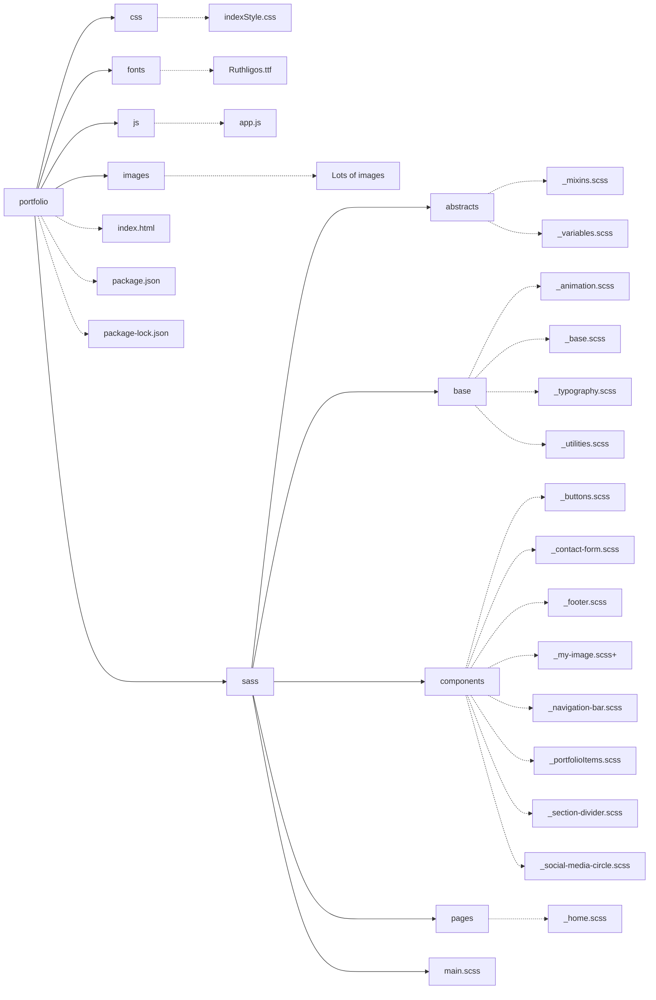

# Portfolio

This Repository contains files of Portfolio Website.

File Structure:

```mermaid
flowchart LR
portfolio --> css-.->indexStyle.css
portfolio --> fonts-.->Ruthligos.ttf
portfolio --> images-..->image[Lots of images]
portfolio --> js-.->app.js
portfolio -.-> indexFile["index.html"]
portfolio -.-> package["package.json"]
portfolio -.-> packageLock["package-lock.json"]
portfolio --->sass
sass ---> abstracts & base & components & pages & mainscss["main.scss"]

abstracts-.->mixins["_mixins.scss"] & variables["_variables.scss"]
base-.-> animation["_animation.scss"] & Base["_base.scss"] & typography["_typography.scss"] & uitlities["_utilities.scss"]
components-.->buttons["_buttons.scss"] & contactForm["_contact-form.scss"] & footer["_footer.scss"] & myImage[_my-image.scss+] & navigationBar["_navigation-bar.scss"] & portfolioItems["_portfolioItems.scss"] & sectionDivider["_section-divider.scss"] & socialMediaCircle["_social-media-circle.scss"]
pages-.->home["_home.scss"]
```
